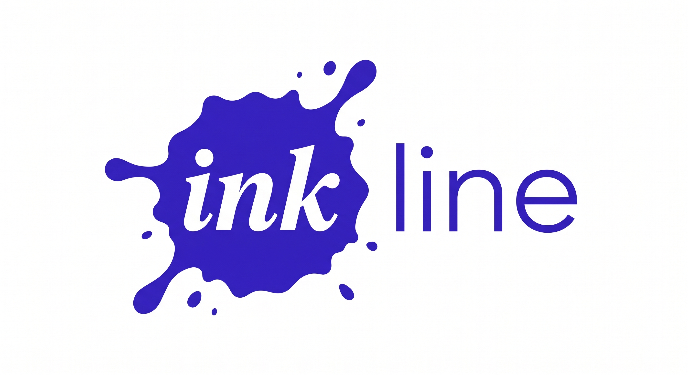

# Inkline

**Branded document & presentation toolkit — Typst, HTML, PDF, PPTX, Google Slides.**

Inkline is two products sharing a codebase:

1. **Execution Engine.** A deterministic, fast, no-LLM renderer. Given a structured markdown spec (typed layouts + `freeform` primitives + `_image:` directives), it produces PDF, PPTX, or HTML. Brand, theme, and font systems are pure-Python. No Claude required at render time.

2. **Design Knowledge Base.** Accumulated playbooks, slide-type catalogue, anti-pattern library, and archetypes — exposed as 17 MCP resources (`inkline://...`) that Claude Code pulls into context when writing a spec.

**Claude Code becomes the design intelligence.** It reads the knowledge base, writes a precise spec with explicit `_layout:` directives, and hands it to the execution engine. The LLM-design path (DesignAdvisor, agentic `/prompt`, two-phase loop) remains fully functional as opt-in **Draft Mode**.

Ships with: 90 built-in themes, 37 slide templates, 22+ slide layouts, 31 chart/exhibit types (11 standard + 5 institutional + 5 derived-from-pitchbook + 16 infographic archetypes), a 1-brand public registry (extensible via plugins), 10 design playbooks exposed as MCP resources, a 771-template archetype catalog, and a two-level audit (structural + post-render vision critique).

---

## Two ways to drive Inkline

**Execute Mode (default)** — Write a markdown spec with `<!-- _layout: ... -->` directives; run `inkline render deck.md`. No LLM at render time. Same spec → same output every time.

**Draft Mode (opt-in)** — Send raw source material to the WebUI or bridge via `POST /prompt`. Inkline's DesignAdvisor picks layouts, runs the 4-phase Archon pipeline, and delivers a reviewed PDF. Requires Claude Code and `inkline serve`.

For most work — especially when Claude Code is already the author — Execute Mode is faster, cheaper, and fully deterministic.

---

## Why Inkline

Inkline is the only code-first slide toolkit that pairs AI authoring with a deterministic renderer: Claude Code reads the knowledge base and authors the spec; the execution engine renders it without any further LLM involvement.

| Feature | Inkline | Gamma | Beautiful.ai | Canva | python-pptx |
|---|:---:|:---:|:---:|:---:|:---:|
| Programmatic (code-first) | ✓ | ✗ | ✗ | ✗ | ✓ |
| LLM design intelligence | Execute Mode + opt-in Draft Mode | ✓ (cloud only) | ✗ | ✗ | ✗ |
| Per-slide visual audit | ✓ (post-render) | ✗ | ✗ | ✗ | ✗ |
| AI image generation | ✓ (via n8n + Gemini) | ✓ | ✗ | ✓ | ✗ |
| Workflow automation (n8n) | ✓ | ✗ | ✗ | ✗ | ✗ |
| Brand system / tokens | ✓ | limited | limited | limited | ✗ |
| Self-learning from feedback | Draft Mode only | ✗ | ✗ | ✗ | ✗ |
| Typst PDF output | ✓ | ✗ | ✗ | ✗ | ✗ |
| Self-hosted / local | ✓ | ✗ | ✗ | ✗ | ✓ |
| 22+ slide type library | ✓ | ✗ | limited | ✓ | ✗ |
| 37 templates | ✓ | limited | limited | ✓ | ✗ |
| 90 themes | ✓ | ✗ | ✗ | limited | ✗ |
| Chart auto-rendering | ✓ | ✓ | limited | ✓ | ✗ |
| Open source | ✓ | ✗ | ✗ | ✗ | ✓ |

---

## Install

```bash
pip install inkline                # core: Markdown → HTML
pip install inkline[typst]         # + Typst PDF (default backend)
pip install inkline[pdf]           # + WeasyPrint PDF
pip install inkline[charts]        # + matplotlib chart renderer
pip install inkline[slides]        # + Google Slides API
pip install inkline[intelligence]  # + LLM design advisor (Anthropic, opt-in Draft Mode)
pip install inkline[app]           # + standalone WebUI + Claude bridge
pip install inkline[mcp]           # + MCP server for Claude Desktop / Claude.ai
pip install inkline[all]           # everything (excludes mcp)
```

---

## Quick Start — Execute Mode

Write a markdown spec with explicit `_layout:` directives, then render:

```bash
inkline render deck.md --output pdf,pptx --brand minimal
```

**Minimal spec example** (`deck.md`):

```markdown
---
brand: minimal
template: consulting
title: Investor Pitch
output: [pdf, pptx]
audit: post-render
---

## The Problem
<!-- _layout: three_card -->
- Problem 1: Market is fragmented across 15+ vendors with no interoperability
- Problem 2: Manual workflows consume 40% of analyst time
- Problem 3: Point-in-time snapshots miss 80% of risk events

## Traction
<!-- _layout: kpi_strip -->
- value: "12"
  label: Pilot customers
- value: "$1.2M"
  label: ARR
- value: "94%"
  label: Retention
```

No Python, no API key, no LLM call. The renderer executes the spec and produces a branded PDF and PPTX. See [`examples/typed_layout_deck/`](examples/typed_layout_deck/) for a complete 8-slide investor pitch.

---

## Architecture

The execution engine (Typst backend + chart renderer + brand system) runs entirely in Python with no LLM dependency. Claude Code reads the knowledge base via MCP resources, authors a spec with explicit `_layout:` directives, and calls `inkline render`. The DesignAdvisor and Archon pipeline layers are still available but are invoked only in opt-in Draft Mode. Post-render critique (`inkline critique`) re-engages a vision model on the finished PDF without influencing the render itself. See [`plan_docs/execution-engine-and-knowledge-base-pivot-spec.md`](plan_docs/execution-engine-and-knowledge-base-pivot-spec.md) for the full architectural rationale.

---

## Knowledge Base (MCP Resources)

The design knowledge base is exposed as MCP resources for Claude Code and Claude Desktop:

```
inkline://layouts                         — slide-type catalogue with capacity rules
inkline://layouts/<slide_type>            — single slide-type spec with examples
inkline://anti-patterns                   — anti-pattern library
inkline://archetypes                      — 771 archetype templates
inkline://brands                          — registered brand list
inkline://themes                          — theme registry
inkline://typography                      — type-scale + capacity rules
inkline://templates                       — template catalogue
inkline://playbooks/index                 — all playbooks with descriptions
inkline://playbooks/chart_selection       — chart selection playbook
inkline://playbooks/color_theory          — colour theory playbook
inkline://playbooks/document_design       — document design playbook
inkline://playbooks/infographic_styles    — infographic styles playbook
inkline://playbooks/professional_exhibit_design — institutional exhibit design
inkline://playbooks/slide_layouts         — slide layout playbook
inkline://playbooks/template_catalog      — template catalogue playbook
inkline://playbooks/typography            — typography playbook
inkline://playbooks/visual_libraries      — visual libraries playbook
```

**Via CLI:**
```bash
inkline knowledge list
inkline knowledge get inkline://layouts/three_card
inkline knowledge search "waterfall chart"
```

**Via HTTP proxy (bridge must be running):**
```bash
curl http://localhost:8082/knowledge/layouts
curl http://localhost:8082/knowledge/playbooks/chart_selection
```

**In a Claude Code session:** the resources are automatically available via the MCP server. When writing a spec, pull the relevant layout and playbook resources into context before authoring.

---

## Capabilities at a glance

- **Execute-mode default** — write a markdown spec with `_layout:` directives; render deterministically with no LLM at render time
- **Freeform slide type** — describe arbitrary positioned-shapes layouts in a JSON manifest (`_shapes_file:`); render with Typst or PPTX backends
- **Image strategy directives** — three strategies: `reuse` (embed existing asset), `generate` (call Gemini via n8n), `placeholder` (grey box for later fill)
- **Post-render critique** — `inkline critique deck.pdf --rubric institutional` runs Vishwakarma vision audit on a finished PDF without re-rendering
- **Per-slide visual audit (Draft Mode)** — every slide inspected by a vision model against 11 design-quality and gate checks before delivery
- **Brand system** — token-based brand registry; drop a `.py` file in `~/.config/inkline/brands/` and your brand auto-registers
- **90 themes × 37 templates × 22 slide types × 31 chart types** — covers institutional finance, consulting, tech, editorial, and creative registers
- **Typst backend** — fast, deterministic PDF compilation with no browser dependency
- **MCP server** — native integration with Claude Desktop and Claude.ai
- **Fully local** — no SaaS dependency; routes LLM calls through a local Claude bridge when Draft Mode is used

---

## Freeform Slides

The `freeform` slide type lets you describe any layout as a JSON shapes manifest — useful for architecture diagrams, custom infographics, and competitive positioning maps where no typed layout fits.

```markdown
## System Architecture
<!-- _layout: freeform
_shapes_file: shapes/architecture_diagram.json -->
```

**Supported shape types:** `rounded_rect`, `rect`, `text`, `line`, `arrow`, `circle`, `polygon`, `image`. Positions and sizes use `%` (relative to slide canvas) or `px` units.

See [`examples/freeform_hero_deck/`](examples/freeform_hero_deck/) for a complete 4-slide technical architecture deck, and [`examples/hybrid_deck/`](examples/hybrid_deck/) for a 5-slide deck mixing typed layouts with a freeform competitive map.

---

## Image Strategy Directives

Attach an `_image:` directive to any slide to control how images are sourced:

```markdown
## Revenue Trend
<!-- _layout: chart_caption
_image: {strategy: reuse, path: assets/revenue_chart.png, slot: right, width: 50%} -->

## Hero Slide
<!-- _layout: split
_image: {strategy: generate, prompt: "Abstract dark blue gradient, 16:9", slot: left} -->

## Placeholder Slide
<!-- _layout: dashboard
_image: {strategy: placeholder, slot: main, width: 60%, height: 80%} -->
```

- `reuse` — validates path at parse time; raises `FileNotFoundError` immediately if missing
- `generate` — calls Gemini multimodal via n8n; content-hash cached; fails loudly on error (no silent fallback)
- `placeholder` — grey box; use for iterative authoring before assets are ready

---

## Post-Render Critique

Run a Vishwakarma vision audit on a finished PDF without re-rendering:

```bash
inkline critique deck.pdf --rubric institutional
inkline critique deck.pdf --rubric tech_pitch
inkline critique deck.pdf --rubric internal_review
```

Returns per-slide verdicts (`PASS` / `WARN` / `FAIL`) with actionable fix hints. Score starts at 100; `-15` per FAIL, `-5` per WARN.

Available rubrics: `institutional` (investment bank standards), `tech_pitch` (startup/VC), `internal_review` (lightweight operational check).

Via the bridge: `POST /critique` with `{"pdf_path": "...", "rubric": "institutional"}`.

---

## Opt-in: Draft Mode — conversational WebUI

For natural-language input or cold-start drafting when you don't have a spec yet.

**Requirements:** [Claude Code](https://docs.claude.com/claude-code) installed and authenticated. Optionally `pandoc` for `.docx` input.

```bash
pip install "inkline[all]"
inkline serve                      # opens http://localhost:8082
```

Upload any file (`.md`, `.docx`, `.pdf`, `.pptx`), type what you want — *"turn this into a 10-slide investor pitch"* — and a branded PDF appears in the browser. Claude Code handles the entire pipeline: file parsing, content structuring, layout selection, rendering, and iterative amendments.

```bash
inkline serve --port 9000          # custom port
inkline bridge                     # bridge only, headless
```

**Claude Desktop / Claude.ai integration (MCP):**

```bash
pip install "inkline[mcp]"
inkline mcp                        # start MCP server (stdio)
```

Add to Claude Desktop config (`~/Library/Application Support/Claude/claude_desktop_config.json`):

```json
{
  "mcpServers": {
    "inkline": { "command": "inkline", "args": ["mcp"] }
  }
}
```

---

## n8n + Workflow Automation

**Orchestrate image generation from Python — batch assets, automate, self-host.**

Inkline integrates **n8n** for programmable image generation: call Gemini, Flux, or other models from Python code to auto-generate backgrounds, icons, and illustrations. Unlike UI-based tools (Gamma Imagine, Canva), you can batch-generate assets, chain them in workflows, and run entirely on your infrastructure.

### Quick start: AI-Generated Icons

```bash
# 1. Start n8n locally
docker run -d -p 5678:5678 n8nio/n8n

# 2. Import the inkblot icon workflow
#    In n8n UI: Menu → Import from file
#    Select: /path/to/inkline/inkblot-icon-generator-workflow.json
#    Update the Gemini API key

# 3. Test it
curl -X POST http://localhost:5678/webhook/inkblot-icon
# Returns: {"image_path": "/path/to/inkblot-icon-512.png"}
```

### AI-Generated Slide Backgrounds

```python
import requests

def generate_ai_background(title, theme, aesthetic, brand_colors):
    """Generate a branded slide background via n8n + Gemini."""
    r = requests.post(
        "http://localhost:5678/webhook/slide-background",
        json={"title": title, "theme": theme, "aesthetic": aesthetic, **brand_colors},
        timeout=120
    )
    return r.json()["image_path"]

bg = generate_ai_background(
    title="Revenue Acceleration",
    theme="consulting",
    aesthetic="bold abstract",
    brand_colors={"brand_primary": "#1F2937", "brand_secondary": "#3B82F6"},
)
```

**Full guide:** See [`plan_docs/n8n-integration-generative-assets.md`](plan_docs/n8n-integration-generative-assets.md)

---

## Quick start — Python API

### Branded report (Typst — default)
```python
from inkline.typst import export_typst_document

export_typst_document(
    markdown="# Q4 Review\n\nRevenue up 34%...",
    output_path="q4_report.pdf",
    brand="minimal",
    title="Q4 2026 Review",
)
```

### Structured slide deck
```python
from inkline.typst import export_typst_slides

slides = [
    {"slide_type": "title", "data": {
        "company": "Acme Corp",
        "tagline": "Series B Pitch",
        "date": "2026-04-09",
    }},
    {"slide_type": "three_card", "data": {
        "section": "Problem", "title": "Three pain points",
        "cards": [
            {"title": "Fragmented data", "body": "..."},
            {"title": "Manual reporting", "body": "..."},
            {"title": "Stale insights", "body": "..."},
        ],
    }},
    {"slide_type": "kpi_strip", "data": {
        "section": "Traction", "title": "2026 YTD",
        "kpis": [
            {"value": "34%",  "label": "Rev growth", "highlight": True},
            {"value": "$4.2M", "label": "ARR"},
            {"value": "87",   "label": "Customers"},
        ],
    }},
]

export_typst_slides(
    slides=slides,
    output_path="acme_pitch.pdf",
    brand="minimal",
    template="consulting",
)
```

### LLM-driven design advisor (Draft Mode)
```python
from inkline.intelligence import DesignAdvisor

advisor = DesignAdvisor(brand="minimal", template="consulting", mode="llm")
slides = advisor.design_deck(
    title="Q4 Strategy Review",
    sections=[
        {"type": "executive_summary", "metrics": {...}, "narrative": "..."},
        {"type": "financials", "table_data": {...}},
        {"type": "risks", "rag": {...}},
    ],
    audience="investors",
    goal="secure term sheet",
)
# `slides` is ready for export_typst_slides()
```

### Chart renderer (matplotlib)
```python
from inkline.typst.chart_renderer import render_chart_for_brand

render_chart_for_brand(
    chart_type="waterfall",
    data={"labels": [...], "values": [...]},
    output_path="exhibit_1.png",
    brand_name="minimal",
)
```

---

## Examples

Three reference specs ship under [`examples/`](examples/):

| Example | Description |
|---|---|
| [`typed_layout_deck/`](examples/typed_layout_deck/) | 8-slide investor pitch using only typed layouts. Each slide has an explanatory comment. |
| [`freeform_hero_deck/`](examples/freeform_hero_deck/) | 4-slide technical architecture deck. One slide uses a `freeform` shapes manifest with 20 shapes. |
| [`hybrid_deck/`](examples/hybrid_deck/) | 5-slide market intelligence report mixing typed layouts with a freeform competitive map. Two-backend output (PDF + PPTX). |

---

## Themes (90 total)

Themes live in `inkline.typst.themes` across 13 categories:

| Category     | Examples                                          |
|--------------|---------------------------------------------------|
| consulting   | Strategy Blue, Strategy Green, Strategy Red, Professional Services, Advisory Orange, Advisory Yellow, Corporate Blue |
| corporate    | Pitchbook, Private Banking, MS, BlackRock         |
| tech         | Stripe, Linear, Vercel, Notion, GitHub            |
| dark         | Nord, Dracula, Catppuccin Mocha, Carbon           |
| warm         | Cigar, Creme, Linen, Terracotta, Clementa         |
| cool         | Borealis, Marine, Serene, Zephyr                  |
| nature       | Sage, Sprout, Moss, Lux                           |
| creative     | Gamma, Electric, Aurora, Nebulae                  |
| editorial    | Piano, Chimney, Editoria                          |
| pastel       | Lavender, Seafoam, Twilight                       |
| luxury       | Aurum, Gold Leaf, Mercury, Mystique               |
| minimal      | Pearl, Onyx, Coal, Howlite                        |
| industry     | Healthcare, Energy, Real Estate, Legal, Education |

```python
from inkline.typst.themes import get_theme, list_themes, search_themes

theme = get_theme("stripe")
warm_themes = list_themes(category="warm")
matches = search_themes("gold")
```

**Private / custom themes** — drop a `.py` file in one of these directories
and any `dict` with a `"name"` key is auto-registered:

1. Every path in `$INKLINE_THEMES_DIR`
2. `~/.config/inkline/themes/`
3. `./inkline_themes/` in the current working directory

---

## Brands

Inkline ships with a single public brand — `minimal` — and an open plugin system for loading additional brands from a user-controlled directory. Drop a `.py` file in one of these locations and any `BaseBrand` instance it defines will be auto-registered at import time:

1. Every path in the `INKLINE_BRANDS_DIR` environment variable
2. `$XDG_CONFIG_HOME/inkline/brands/` (default: `~/.config/inkline/brands/`)
3. `./inkline_brands/` in the current working directory

Asset files (logos, fonts) are looked up in a parallel list of directories (`INKLINE_ASSETS_DIR`, `~/.config/inkline/assets/`, `./inkline_assets/`, then the package's bundled assets).

This means personal / proprietary brands — with their own logos, palettes, and confidentiality strings — live **outside** this repository and are never committed.

Example brand file (`~/.config/inkline/brands/mycorp.py`):

```python
from inkline.brands import BaseBrand

MyCorpBrand = BaseBrand(
    name="mycorp",
    display_name="My Corporation",
    primary="#0B5FFF", secondary="#00C2A8",
    background="#FFFFFF", surface="#0A2540", text="#111827",
    muted="#6B7280", border="#E5E7EB", light_bg="#F8FAFC",
    heading_font="Inter", body_font="Inter",
    logo_dark_path="mycorp_logo_white.png",
    logo_light_path="mycorp_logo_dark.png",
    confidentiality="Private & Confidential",
    footer_text="My Corporation",
)
```

---

## Design system — encoded taste (v0.5)

Inkline encodes aesthetic quality as layers that fire in the execution engine and in Draft Mode:

**TasteEnforcer** — ten deterministic rules run before rendering regardless of LLM output:
- Bar charts always get `style: "clean"` (no axes, direct value labels)
- Donuts with ≤ 6 segments always get `label_style: "direct"` (radial labels, no legend)
- Scatter with named points always gets `label_style: "annotated"` (callout boxes)
- `accent_index` auto-inferred on bar charts if not set (highlights highest value)
- Panel charts inside multi_chart have embedded titles cleared automatically

**Decision framework (Draft Mode):** The LLM advisor answers three questions (data shape → message type → exhibit type), then looks up the answer in a decision matrix. 27 rules seeded from top-tier investment bank and consulting firm chart grammar.

**Self-learning loop (Draft Mode):** User feedback (explicit + implicit from conversation) updates rule confidence. Users can also ingest reference PDFs to extract new design patterns.

```bash
inkline learn                          # process feedback log, update DM confidence
inkline ingest /path/to/pitchbook.pdf  # extract patterns from a reference deck
```

---

## Slide types (22)

**Standard:** `title`, `content`, `three_card`, `four_card`, `stat`, `table`,
`split`, `bar_chart`, `kpi_strip`, `closing`

**Infographic:** `timeline`, `process_flow`, `icon_stat`, `progress_bars`,
`pyramid`, `comparison`, `feature_grid`

**Data exhibit:** `dashboard`, `chart_caption`, `multi_chart`

**Embedded:** `chart` (matplotlib PNG/SVG)

**Freeform:** `freeform` (positioned-shapes manifest)

### `multi_chart` — multi-exhibit grid layout

Arrange 2–4 pre-rendered chart images in configurable asymmetric grids:

```python
{
    "slide_type": "multi_chart",
    "data": {
        "section": "Market Overview",
        "title": "Four-panel market dashboard",
        "layout": "hero_left_3",   # 50/25/25 — hero chart + two supporting
        "charts": [
            {"image_path": "revenue_trend.png", "title": "Revenue trend"},
            {"image_path": "asset_mix.png",     "title": "Asset mix"},
            {"image_path": "ebitda.png",         "title": "EBITDA margin"},
        ],
        "footnote": "Source: management accounts",
    }
}
```

Supported layouts: `equal_2`, `equal_3`, `equal_4`, `hero_left`, `hero_left_3`, `hero_right_3`, `quad`, `top_bottom`, `three_top_wide`, `left_stack`, `right_stack`, `mosaic_5`, `six_grid`

---

## Chart types (31+)

### Standard charts (11)
`line_chart`, `area_chart`, `scatter`, `waterfall`, `donut`, `pie`,
`stacked_bar`, `grouped_bar`, `heatmap`, `radar`, `gauge`

**Enhanced in v0.5:** `style: "clean"` on bars removes axes and adds direct value labels. `accent_index`/`accent_series` marks one element in accent colour. `label_style: "direct"` on donuts removes the legend. `label_style: "annotated"` on scatter adds callout boxes per point.

### Institutional exhibit types (4)
| Type | Description |
|------|-------------|
| `marimekko` | Proportional mosaic — column width and cell height both encode data; no axes |
| `entity_flow` | Legal/org structure diagram with tiered grey palette |
| `divergent_bar` | Vertical bars above/below zero baseline; floating value labels |
| `horizontal_stacked_bar` | 100% stacked horizontal bars showing composition shift over time |

### Pitchbook-derived chart types (5)

| Type | Best for |
|------|----------|
| `dumbbell` | Before/after pairs, spread migration, analyst estimate vs actual |
| `transition_grid` | Business model transitions, revenue mix shifts over time |
| `scoring_matrix` | Capability comparison matrices (scores 0–3 render as ○◔◕●) |
| `gantt` | Construction programmes, project roadmaps, parallel workstreams |
| `multi_timeline` | M&A/fundraising timelines with duration + phase + task detail |

### Infographic archetypes (16, rendered via `chart_row`)
`iceberg`, `sidebar_profile`, `funnel_kpi_strip`, `persona_dashboard`,
`radial_pinwheel`, `hexagonal_honeycomb`, `semicircle_taxonomy`,
`process_curved_arrows`, `pyramid_detailed`, `ladder`, `petal_teardrop`,
`funnel_ribbon`, `dual_donut`, `waffle`, `metaphor_backdrop`, `chart_row`

---

## Slide templates (37+)

10 curated built-in templates plus 27 additional design system styles, with support for unlimited private custom templates via the plugin system:

**Built-in:** `executive`, `minimalism`, `newspaper`, `investor`, `consulting`,
`pitch`, `dark`, `editorial`, `boardroom`, `brand`

**Additional styles:** `dmd_stripe`, `dmd_vercel`, `dmd_notion`, `dmd_apple`,
`dmd_spotify`, `dmd_tesla`, `dmd_airbnb`, `dmd_coinbase`, `dmd_shopify`,
`dmd_figma`, `dmd_framer`, `dmd_cursor`, `dmd_warp`, `dmd_supabase`,
`dmd_uber`, `dmd_ferrari`, `dmd_bmw`, `dmd_mongodb`, `dmd_intercom`,
`dmd_webflow`, `dmd_miro`, `dmd_posthog`, `dmd_raycast`, `dmd_revolut`,
`dmd_superhuman`, `dmd_zapier`, `dmd_claude`

**Private / custom templates** — drop a `.py` file in one of these directories
and any `dict` with a `"desc"` key is auto-registered as a new template:

1. Every path in `$INKLINE_TEMPLATES_DIR`
2. `~/.config/inkline/templates/`
3. `./inkline_templates/` in the current working directory

---

## Overflow audit

Inkline enforces content limits per slide layout and runs an audit at export time:

```python
from inkline.intelligence import audit_deck, format_report

warnings = audit_deck(slides)
print(format_report(warnings))
# OVERFLOW AUDIT: 0 errors, 2 warnings, 0 info
# [WARN] slide 3 (content): field 'items' has 15 items but slide capacity is 8...
```

`export_typst_slides()` runs the audit automatically and logs warnings. Pass `audit=False` to disable.

---

## CLI

```bash
# Execute-mode (no LLM)
inkline render deck.md --brand minimal --output pdf,pptx
inkline render deck.md --watch                  # watch + re-render on save
inkline render deck.md --strict-directives      # treat unknown directives as errors

# Post-render critique
inkline critique deck.pdf --rubric institutional

# Knowledge base
inkline knowledge list
inkline knowledge get inkline://layouts/three_card
inkline knowledge search "waterfall"

# Document generation
inkline-html report.md --brand minimal --title "My Report"
inkline-pdf  report.md --brand mycorp  --title "Quarterly Review"

# Draft Mode (requires Claude Code)
inkline serve                      # WebUI at http://localhost:8082
inkline serve --port 9000
inkline bridge                     # bridge only, headless
inkline mcp                        # MCP server (stdio)

# Design system / self-learning (Draft Mode)
inkline learn                      # process feedback log, update decision matrix
inkline ingest pitchbook.pdf       # extract design patterns from a reference PDF
```

---

## Vishwakarma design philosophy

All LLM-driven design decisions (in Draft Mode) are governed by four laws baked into the system prompts:

1. **Visual hierarchy** — Infographic-first decision ladder. Priority within Tier 1 is **1C → 1B → 1A**: always try to fill a multi-exhibit layout first, then a single structural infographic, then a plain KPI callout.

   | Priority | Tier | What | Examples |
   |----------|------|------|---------|
   | ① highest | 1C | Multi-exhibit slide | `multi_chart`, `chart_row` |
   | ② | 1B | Structural infographic | `iceberg`, `waffle`, `hexagonal_honeycomb`, `radial_pinwheel`, `ladder`, `funnel_kpi_strip`, `persona_dashboard`, `metaphor_backdrop` + 7 more |
   | ③ | 1A | KPI callout | `kpi_strip`, `icon_stat`, `progress_bars`, `feature_grid` |
   | ④ | 2 | Institutional exhibit | `marimekko`, `entity_flow`, `divergent_bar`, `horizontal_stacked_bar`, `chart_caption`, `dashboard` |
   | ⑤ | 3 | Structural visual | `three_card`, `four_card`, `comparison`, `split`, `timeline`, `process_flow` |
   | ⑥ | 4 | Data table | `table` (≤ 6×6) |
   | ⑦ last | 5 | Text bullets | `content` — ≤ 1 per deck, justify why nothing else fit |

2. **Bridge first** — Every LLM call routes through the local Claude bridge (`localhost:8082`) before touching the Anthropic API. Zero incremental API cost when Claude Max is running.
3. **Visual audit mandatory** — Every Draft Mode deck gets a vision auditor that checks each rendered slide PNG against design-quality and gate checks.
4. **Archon oversight** — A single `Archon` instance supervises each Draft Mode pipeline run and writes a structured issues report at completion.

See `inkline.intelligence.vishwakarma` for the constants.

---

## Repository layout

```
src/inkline/
├── brands/           # public brand(s) + plugin loader
├── html/             # Markdown → styled HTML
├── pdf/              # WeasyPrint PDF backend
├── pptx/             # python-pptx backend
├── slides/           # Google Slides API
├── typst/            # Typst backend (default)
│   ├── slide_renderer.py    # 22 slide layouts (incl. freeform, multi_chart)
│   ├── chart_renderer.py    # 31 chart/exhibit renderers
│   ├── taste_enforcer.py    # TasteEnforcer — 10 deterministic taste rules
│   ├── theme_registry.py    # template → theme generation
│   └── themes/              # 90 themes in 13 categories
├── authoring/        # Directive grammar, freeform, image strategy, class/plugin system
│   ├── image_strategy.py    # _image: directive — reuse/generate/placeholder
│   ├── freeform.py          # _shapes_file: JSON manifest parser + validator
│   └── directives.py        # register() plugin API for custom directives
├── intelligence/     # Design advisor + overflow audit + self-learning (Draft Mode)
│   ├── design_advisor.py          # DesignAdvisor — decision framework (Draft Mode)
│   ├── decision_matrix_default.yaml # 27 seed rules
│   ├── vishwakarma.py             # design philosophy + critique_pdf()
│   ├── archon.py                  # pipeline supervisor (Draft Mode)
│   └── playbooks/                 # 10 design playbooks
└── app/              # Standalone app layer (pip install inkline[app])
    ├── claude_bridge.py   # HTTP bridge → claude CLI (port 8082)
    ├── mcp_server.py      # MCP server — tools + 17 resource URIs
    ├── mcp_resources.py   # inkline:// URI registry
    ├── cli.py             # inkline serve / render / critique / knowledge / bridge / mcp
    └── static/
        └── index.html     # thin WebUI: file upload, chat, live PDF preview
```

---

## Identity

### Mark System (v1 & v2)

**v1 — Geometric mark** (app icon, established lockups)
<p align="center">
  &nbsp;&nbsp;&nbsp;
  
</p>

**v2 — Ink-blot system** (editorial, investor decks, brand-forward) — *New in April 2026*
<p align="center">
  &nbsp;&nbsp;&nbsp;
  
</p>

The **v2 system** splits Inkline's identity across two typefaces: **Cormorant Garamond italic** for "ink" (craft, editorial) + **Plus Jakarta Sans** for "line" (software, geometry). Both systems share **Inkline Indigo (#3D2BE8)** as the primary accent. The v1 mark remains canonical for product UI; v2 is used for high-impact editorial and investor materials (see [`brand/decks/`](brand/decks/)).

**Complete brand system:** [`brand/BRAND_GUIDELINES.md`](brand/BRAND_GUIDELINES.md)

### Colour System

| Token | Hex | Usage |
|-------|-----|-------|
| Ink | `#0A0A0A` | Primary text |
| Indigo | `#3D2BE8` | Brand primary, CTAs, mark |
| Indigo Light | `#5B4FFF` | Gradient start, hover states |
| Vellum | `#F7F6F2` | Page background, card fills |
| Slate | `#64748B` | Secondary text, captions |
| Rule | `#E2E1DC` | Dividers, borders, table rules |

---

## Documentation

- [Technical specification](docs/TECHNICAL_SPEC.md)
- [Archon audit workflow](docs/ARCHON_AUDIT.md) — Draft Mode pipeline
- [Closed-loop audit spec](docs/CLOSED_LOOP_AUDIT_SPEC.md)
- [Pivot specification](plan_docs/execution-engine-and-knowledge-base-pivot-spec.md) — full architectural rationale
- [Migration guide](MIGRATION.md) — from pre-pivot to execute-mode default
- [Brand guidelines](brand/BRAND_GUIDELINES.md)

---

## Contributing

Pull requests welcome. Please open an issue first for significant changes.

## Testing

```bash
pip install -e .[all] pytest
pytest tests/ -v
```

## License

MIT — see [LICENSE](LICENSE).
